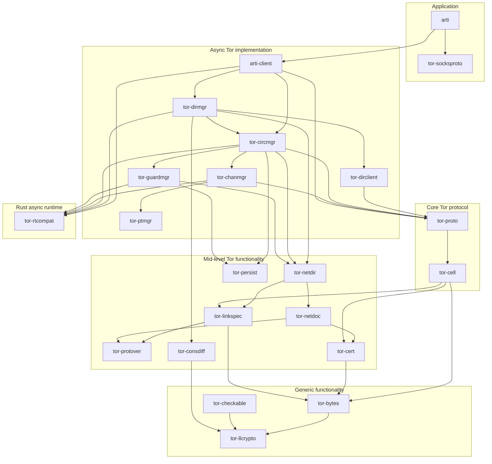
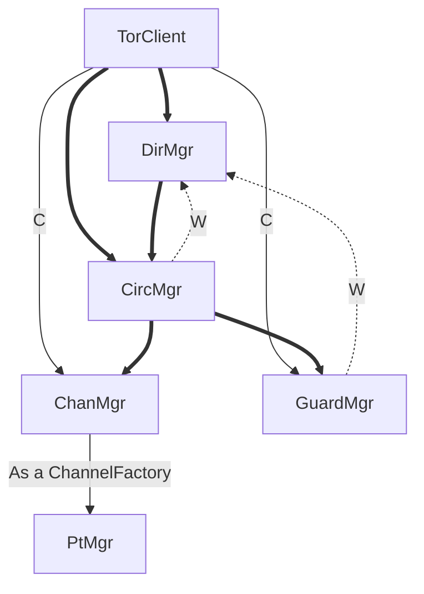

# Arti: Architectural notes and outline.

## Guidelines

I'm hoping to have small, optional, separable pieces here.

I'd like as little code as possible to actually read and write to the
network, and as much code as possible to pretend that the network doesn't
exist.  I hope this will make everything easier to test.

## Structure

Here follows a rough outline of our current crate dependency diagram.  (Not all
crates and not all dependencies are shown; this diagram is simplified in order to 
try to give a better understanding of the code structure.)

As a naming convention, crates that are user-facing start with "arti", crates
that are tor-specific start with "tor-", and crates that aren't tor-specific
have more general names.

### Simplified module diagram



### List of crates

The current crates are:

* [`arti-bench`](../../crates/arti-bench/README.md) -- A simple benchmarking utility for Arti.
* [`arti-client`](../../crates/arti-client/README.md) -- High-level functionality for accessing the Tor network as a client.
* [`arti-config`](../../crates/arti-config/README.md) -- Removed crate.  (Tools for configuration management in Arti)
* [`arti-hyper`](../../crates/arti-hyper/README.md) -- High-level layer for making http(s) requests the Tor network as a client.
* [`arti`](../../crates/arti/README.md) -- A minimal command line program for connecting to the Tor network
* [`arti-testing`](../../crates/arti-testing/README.md) -- Tool for running an Arti client with unusual behavior or limitations.
* [`caret`](../../crates/caret/README.md) -- Integers with some named values.
* [`fs-mistrust`](../../crates/fs-mistrust/README.md) -- Check whether file permissions are private.
* [`retry-error`](../../crates/retry-error/README.md) -- An error attempt to represent multiple failures.
* [`safelog`](../../crates/safelog/README.md) -- Mark data as sensitive for logging purposes.
* [`tor-basic-utils`](../../crates/tor-basic-utils/README.md) -- Utilities (low-level) for Tor
* [`tor-bytes`](../../crates/tor-bytes/README.md) -- Utilities to decode/encode things into bytes.
* [`tor-cell`](../../crates/tor-cell/README.md) -- Coding and decoding for the cell types that make up Tor's protocol
* [`tor-cert`](../../crates/tor-cert/README.md) -- Implementation for Tor certificates
* [`tor-chanmgr`](../../crates/tor-chanmgr/README.md) -- Manage a set of channels on the Tor network.
* [`tor-checkable`](../../crates/tor-checkable/README.md) -- Traits for wrapping up signed and/or time-bound objects
* [`tor-circmgr`](../../crates/tor-circmgr/README.md) -- circuits through the Tor network on demand.
* [`tor-config`](../../crates/tor-config/README.md) -- Tools for configuration management in Arti
* [`tor-congestion`](../../crates/tor-congestion/README.md) -- Algorithms for congestion control on the Tor network
* [`tor-consdiff`](../../crates/tor-consdiff/README.md) -- Restricted ed diff and patch formats for Tor.
* [`tor-dirclient`](../../crates/tor-dirclient/README.md) -- Implements a minimal directory client for Tor.
* [`tor-dirmgr`](../../crates/tor-dirmgr/README.md) -- Code to fetch, store, and update Tor directory information.
* [`tor-error`](../../crates/tor-error/README.md) -- Support for error handling in Tor and Arti
* [`tor-events`](../../crates/tor-events/README.md) -- Tools for generating a stream of structured events, similar to C tor's `ControlPort`.
* [`tor-guardmgr`](../../crates/tor-guardmgr/README.md) -- Guard node selection for Tor network clients.
* [`tor-linkspec`](../../crates/tor-linkspec/README.md) -- Descriptions of Tor relays, as used to connect to them.
* [`tor-llcrypto`](../../crates/tor-llcrypto/README.md) -- Low-level cryptographic implementations for Tor.
* [`tor-netdir`](../../crates/tor-netdir/README.md) -- Represents a clients'-eye view of the Tor network.
* [`tor-netdoc`](../../crates/tor-netdoc/README.md) -- Parse and represent directory objects used in Tor.
* [`tor-persist`](../../crates/tor-persist/README.md) -- Persistent data storage for use with Tor.
* [`tor-proto`](../../crates/tor-proto/README.md) -- Implementations for the core Tor protocol
* [`tor-protover`](../../crates/tor-protover/README.md) -- Implementation of Tor's "subprotocol versioning" feature.
* [`tor-ptmgr`](../../crates/tor-ptmgr/README.md) -- Manage a set of anti-censorship pluggable transports.
* [`tor-rtcompat`](../../crates/tor-rtcompat/README.md) -- Compatibility between different async runtimes for Arti.
* [`tor-rtmock`](../../crates/tor-rtmock/README.md) -- Support for mocking with `tor-rtcompat` asynchronous runtimes.
* [`tor-socksproto`](../../crates/tor-socksproto/README.md) -- Implements SOCKS in the flavors provided by Tor.
* [`tor-units`](../../crates/tor-units/README.md) -- Safe wrappers for primitive numeric types.

## Design considerations, privacy considerations.

As we build the APIs for Arti, we've been aiming for
simplicity and safety: we want it to be as easy as possible to use
`arti-client`, while trying to make certain kinds of privacy or security
violation hard to write accidentally.

The lower-level we get, however, the more safety we lose.  If we need to
allow a piece of functionality that isn't safe for general purposes, we
usually put it at a more low-level crate.

Privacy isn't just a drop-in feature, however.  There are still
plenty of ways to accidentally leak information, even if you're
anonymizing your connections over Tor.  We'll try to document
those in a user's guide at some point as Arti becomes more mature.

## Object dependencies and handling dependency inversion.

(Or, "Why so much `Weak<>`?")

Sometimes we need to add a circular dependency in our object graph. For example,
the directory manager (`DirMgr`) needs a circuit manager (`CircMgr`) in order to
contact directory services, but the `CircMgr` needs to ask the `DirMgr` for a
list of relays on the network, in order to build circuits.

We handle this situation by having the lower-level type (in this case the
`CircMgr`) keep a weak reference to the higher-level object, via a `Weak<dyn
Trait>` pointer.  Using a `dyn Trait` here allows the lower-level crate to
define the API that it wants to use, while not introducing a dependency on the
higher-level crate.  Using a `Weak` pointer ensures that the lower-level object
won't keep the higher level object alive: thus when the last strong reference to the
higher-level object is dropped, it can get cleaned up correctly.

Below is a rough diagram of how our high-level "manager" objects fit together.
**Bold** lines indicate a direct, no-abstraction ownership relationship.  Thin
lines indicate ownership for a single purpose, or via a limited API.  Dotted
lines indicate a dependency inversion as described above, implemented with a 
`Weak<dyn Trait>`.



We also use `Weak<>` references to these manager objects when implementing
**background tasks** that need to run on a schedule.  We don't want the
background tasks to keep the managers alive if there are no other references to
the `TorClient`, so we tend to structure them more or less as follows:

```rust
async fn run_background_task(mgr: Weak<FooMgr>, schedule: ScheduleObject) {
    while schedule.await {
        if let Some(mgr) = Weak::upgrade(&mgr) {
            // Use mgr for background task
            // ...
        } else {
            break;
        }
    }
```


