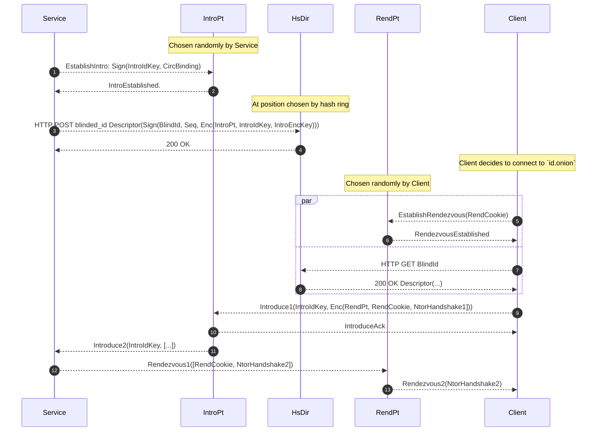

# How do onion services work?

Here's an interaction diagram, since I hear you like those.  (It's in something
called "mermaid", but apparently gitlab can render that, and so can rustdoc
(with the appropriate plugin).)

Note 1: All communications are done over anonymous Tor circuits.

Note 2: In reality, each onion service establishes multiple introduction points
at a time, and uploads its descriptor to multiple HsDirs.  The diagram above is
simplified.

Note 3: The actual data formats are slightly simplified here; in reality, there
is typically room for extensions, more kinds of keys, and so on.

Before we begin:

* The onion service has made an ed25519 "identity key" that is encoded in its
  address as `id.onion`.  
* It has computed, for the current time period, a "blinded identity key" that
  can be derived through a one-way process from the original ID key and the
  current time period.
* It has made, for the current time period, a "descriptor signing key" that is
  authenticated via a certificate issued by the blinded identity key.

Now we get to the communications steps in the diagram:

1. The onion service wants to advertise itself.  It chooses a random
   introduction point on the network. For this introduction point, it creates  a
   random ed25519 "introduction id key" (to identify it with this introduction
   point), and a random curve25519 "introduction encryption key" (for clients to
   use when talking to it via this introduction point). 
   
   The onion service tells the introduction point to make a given circuit an
   introduction circuit for the given "introduction id key".  It authenticates
   this method with the introduction ID key itself.  To prevent replays, the
   message also includes a "circuit binding" token derived from when the circuit
   was constructed.

2. The introduction point replies to report success.

   Note that the introduction point knows only the introduction id key for its
   associated circuit; it does not know any other keys.

3. The onion service generates a descriptor and uploads it to a HsDir.  The
   HsDir is determined by a position on the hash ring derived from the blinded key identity, the current time period, and the current shared random value.
   
   The descriptor is signed by the descriptor signing key.  It contains:
     * The blinded identity key.
     * The certificate signed by the blinded identity key, certifying 
       the descriptor signing key.
     * A sequence number to prevent rollbacks
     * A section encrypted with a symmetric key derived from the service's true identity, containing:
       * A list of introduction points and their associated keys.

4. The HsDir verifies that the certificate and descriptor are well-signed, and
   that the correctly proves ownership of the descriptor using the blinded
   identity key.  It verifies that it does not have any other descriptor for the
   same blinded identity key with a higher sequence number.  Finally, the HsDir
   stores the descriptor indexed at the blinded id, replying with 200 OK.

   Note that the HSDir has learned only the blinded id for the service.  Unless
   it knows the true identity from some other mechanism, it cannot determine the
   introduction points or their associated keys.

At this point the onion service is running; it keeps its circuit open to the
introduction point and waits to hear more.

Now a client comes along.  It is told to connect to `id.onion`, and computes the
blinded id key (and the corresponding location on the hash ring) using the same
logic as the service.

5. If the client does not already have one ready, it opens a circuit to a
   randomly chosen rendezvous point, and tells it to wait for another party
   presenting the same rendezvous cookie.

6. The rendezvous point replies with "rendezvous established."

7. In parallel with steps 5 and 6 if needed, the client connects to the HsDir and
   fetches the descriptor, indexed by the blinded ID.

8. The HsDir replies with the latest descriptor for the given service.

   The client validates the descriptor, decrypts the signed portion of the
   descriptor, and learns the service's current introduction points and keys.

9. The client contacts the introduction point, and sends it an Introduce1 message.
   The outer portion of the cell just says which onion service (by introduction
   id key) should receive the inner portion; the inner portion is encrypted
   using the introduction encryption key (which the introduction point does not
   know).

   The encrypted inner portion contains:
      * the rendezvous cookie
      * information about the rendezvous point
      * the start of a cryptographic handshake with the service.

10. The introduction point acknowledges the client.

11. The introduction point delivers the inner portion of the Introduce1 message
    to the service, on the circuit that was established in step 1.

12. The service decrypts and validates the material from the client, to learn
    the rendezvous point and the rendezvous cookie.  (It also computes the
    second part of the cryptographic handshake, along with a set of associated
    key material.)

    The service checks for replays.  It needs to maintain a separate replay cache for
    each introduction id key.

    The service builds a circuit to the rendezvous point and presents the
    rendezvous cookie, along with its half of the handshake.

13. If the cookie matches n a circuit that the rendezvous point knows about, 
    it relays the service's handshake back to the client, over the circuit that the
    client established in step 5.  
    
    The rendezvous point also now joins the client's circuit from step 5 and
    the service's circuit from step 12, so that future messages will be relayed
    between them. 

Now, at last, the client has received the service's handshake over the expected
circuit. The client completes the handshake, to get a set of shared encryption
keys with the service.  Now the client and service have a pair of joined
circuits, and a set of encryption material to use to communicate.

## Well hang on, what about authentication?

There are two places where authentication can be added to the protocol above.

The first instance is when encrypting the descriptor: The service can encrypt
the list of introduction points in the descriptor so that only a client holding
one of several curve25519 keys can decrypt it.  This requires storage space
proportional to the number of supported clients, so the upper limit is bounded.

The second instance is when receiving the introduce2 request: The client can
include a random value in the introduce2 message, signed with an ed25519 signing
key, to prove its identity.

> Aside: It would be a good thing to have a better authentication method that
> signs more of the introduce2 request (like the rendezvous cookie, the intro
> point public key, the X value from the ntor handshake, etc) in order to make
> replays less feasible.

