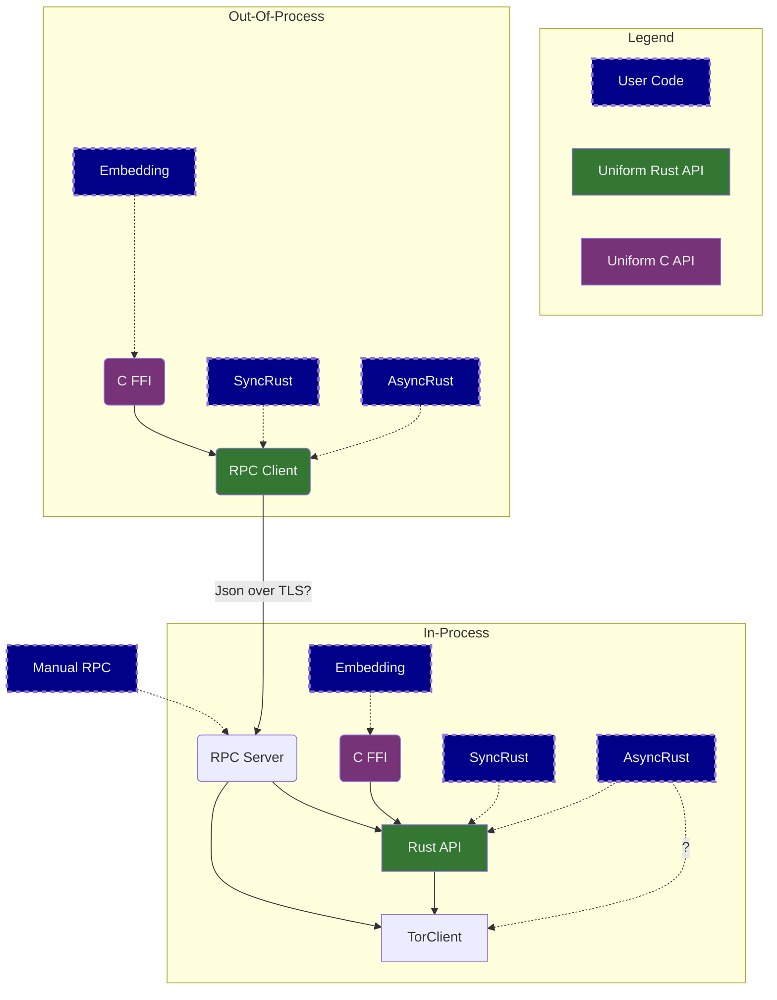

# Let's meditate on FFI and RPC designs.

> These are Nick's thoughts, as of 3 February 2023.
> They are not an official plan.

People want to call Arti in several ways.

The calling language might be...
   1. Sync Rust
   2. Async Rust
   3. Something else
 
 The calling environment might be...
   1. In-process
   2. Out-of-process
   3. Via some mechanism that lets the application ignore whether it is in-process or out-of-process.

Premise: we would like to define as few APIs as possible.
But if we aren't careful, we'll wind up with 9 different APIs, 
to cover all `3×3` of the different cases above.
(C Tor is basically in this situation.)

So to that end, 
let's try to define a single Rust API
that supports sync and async uses,
and which can be implemented remotely or in-process.
Let's also define a single C FFI API
that closely mirrors that Rust API, 
and which can be implemented remotely or in-process.

# Ooh look, a diagram!

# Challenges

## 1: RPC is never invisible

Notoriously, RPC has failure modes that make it annoying 
to use the same API for in-process and out-of-process calls.
Yet that is exactly what we're proposing to do here!

Can this possibly be wise?

> My thoughts: I think it's not too bad. Inasmuch as Tor is a protocol for being a proxy, callers already have to deal with the possibility that the network is down, that their operations will be slow or cancelled, and so on.  So having one more possible cause for slowness and/or cancellation should be No Big Deal.  Maybe?

## 2: Wow, that's a lot of ways to call Arti!

If we want to add a new feature to our API, we will in the worst case need to add that feature to:
  * The abstract Rust API definition
  * The abstract C API definition
  * The "Rust API" module
  * The RPC Server
  * The RPC Client
  * Both "C FFI" wrappers

So it seems:
   * We need some way to automate all of this code generation as much as possible
   * We need some way to keep the API small.

And this last point leads to our next challenge...

## 3: A big API is harder to export; a small API is harder to make type-safe

Up till now, we've been adding stuff to the `arti-client` crate without too much worry.  But some parts of our API (notably, our configuration and configuration builder logic) are pretty huge, inasmuch as they try to enable compile time checking of configuration options and types.

As an alternative, we could introduce points of detail-hiding, like providing a "`set_option(name:&str, val:&str)`" API.  The more of our API we can make "string-ly typed" typed in this way, the smaller it would be, but harder it would be to ensure good compile-time type checking.  

Perhaps we can some up with some way to make things "jsonly-typed" instead?  It still seems like a regrettable kludge.

> My inclination: pursue the "jsonly-typed" option.  Look for ways to expose things as object trees.  Look for abstractions that let us minimize our API surface.

## 4: Whither `TorClient`?

If the preferred way to use Arti in Rust is now via a uniform Rust API, then should we deprecate use of the `TorClient` API?  Or should we deprecate those parts of it that can't be made part of the "uniform Rust API"?

Or should we leave it sitting around permanently as yet another API surface, for those who only want to use Arti embedded from Rust?

> My inclination:  Massage TorClient so that most of it is used via the uniform Rust API; allow it to have additional features that are not in that uniform Rust API; say that using those features means you can only be in-process.

## 5: Oh yeah, that RPC protocol...

We're putting a lot of constraints into this system, in a way that has implications for our RPC design.  The more we say here, the less likely it is that we "manual RPC" users will be able to use an off-the-shelf RPC tool to call Arti.

Do we care?  Do our users?

# How do you even prototype something like this?

I think I'd like to start by designing a few key operations in it, and looking at what they would imply for the API at all layers.  From that, we can probably figure out more about the general shape of the design, and which spots make more sense than others.

In parallel, I'd look for ways to have all of our implementations share as much code as possible.  For instance, could we use a single message-handling implementation under the hood, so that our in-process and out-of-process APIs differed only in whether they had to touch the network?  Could our C FFI layer be written to wrap a Rust trait that provides our API, so that we only need to implement that once?

I'd also try to think about ways to specify and document this API so that we didn't have to define every piece of functionality five or six times.

