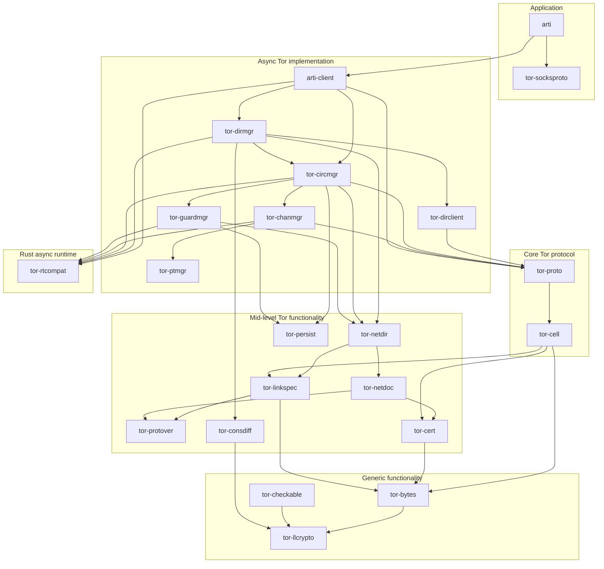
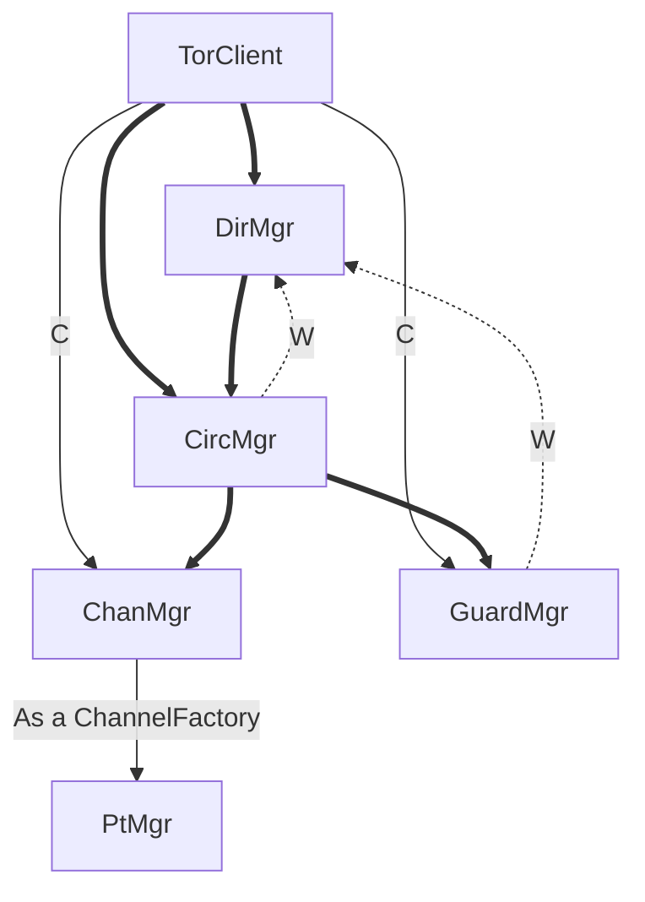

Below is a basic overview of our existing crate dependency diagram. 

As a naming convention, crates that are user-facing start with `arti-`, crates that are tor-specific start with `tor-`, and crates that aren't tor-specific have more general names.

**Note:** This diagram simplifies the code structure but does not display all crates and dependencies. It aims to provide a clearer understanding of Arti's overall architecture.

### Simplified module diagram



### List of crates

The current available crates are:

| Crate | Description |
| --- | --- |
| arti-bench | A simple benchmarking utility for Arti. |
| arti-client | High-level functionality for accessing the Tor network as a client. |
| arti-config | Removed crate. (Tools for configuration management in Arti). |
| arti-hyper | High-level layer for making http(s) requests the Tor network as a client. |
| arti | A minimal command line program for connecting to the Tor network. |
| arti-testing | Tool for running an Arti client with unusual behavior or limitations. |
| caret | Integers with some named values. |
| fs-mistrust | Check whether file permissions are private. |
| retry-error | An error attempt to represent multiple failures. |
| safelog | Mark data as sensitive for logging purposes. |
| tor-basic-utils | Utilities (low-level) for Tor. |
| tor-bytes | Utilities to decode/encode things into bytes. |
| tor-cell | Coding and decoding for the cell types that make up Tor's protocol. |
| tor-cert | Implementation for Tor certificates. |
| tor-chanmgr | Manage a set of channels on the Tor network. |
| tor-checkable | Traits for wrapping up signed and/or time-bound objects. |
| tor-circmgr | Circuits through the Tor network on demand. |
| tor-config | Tools for configuration management in Arti. |
| tor-consdiff | Restricted ed diff and patch formats for Tor. |
| tor-dirclient | Implements a minimal directory client for Tor. |
| tor-dirmgr | Code to fetch, store, and update Tor directory information. |
| tor-error | Support for error handling in Tor and Arti. |
| tor-events | Tools for generating a stream of structured events, similar to C tor's ControlPort. |
| tor-guardmgr | Guard node selection for Tor network clients. |
| tor-linkspec | Descriptions of Tor relays, as used to connect to them. |
| tor-llcrypto | Low-level cryptographic implementations for Tor. |
| tor-netdir | Represents a clients'-eye view of the Tor network. |
| tor-netdoc | Parse and represent directory objects used in Tor. |
| tor-persist | Persistent data storage for use with Tor. |
| tor-proto | Implementations for the core Tor protocol. |
| tor-protover | Implementation of Tor's "subprotocol versioning" feature. |
| tor-ptmgr | Manage a set of anti-censorship pluggable transports. |
| tor-rtcompat | Compatibility between different async runtimes for Arti. |
| tor-rtmock | Support for mocking with tor-rtcompat asynchronous runtimes. |
| tor-socksproto | Implements SOCKS in the flavors provided by Tor. |
| tor-units | Safe wrappers for primitive numeric types. |

## Design considerations, privacy considerations.

As we build the APIs for Arti, our focus has been on ensuring user-friendly experiences with the `arti-client`. We plan to make it simple to use, while also working to minimize the risk of unintentional privacy or security breaches.

The further we get into lower-level concepts, the greater the compromise on safety. If we need to allow a piece of functionality that isn't safe for general purposes, we usually put it at a more low-level crate.

Privacy isn't just a drop-in feature, however. There are still plenty of ways to accidentally leak information, even if you're anonymizing your connections over Tor. We'll try to document those in a user's guide at some point as Arti becomes more mature.

## Object dependencies and handling dependency inversion.

(Or, "Why so much `Weak<>`?")

Sometimes we need to add a circular dependency in our object graph. For example, the directory manager (`DirMgr`) needs a circuit manager (`CircMgr`) in order to contact directory services, but the `CircMgr` needs to ask the `DirMgr` for a list of relays on the network, in order to build circuits.

We handle this situation by having the lower-level type (in this case the `CircMgr`) keep a weak reference to the higher-level object, via a `Weak<dyn Trait>` pointer.  Using a `dyn Trait` here allows the lower-level crate to define the API that it wants to use, while not introducing a dependency on the higher-level crate. 

Using a `Weak` pointer ensures that the lower-level object won't keep the higher level object alive: thus when the last strong reference to the higher-level object is dropped, it can get cleaned up correctly.

Below is a rough diagram of how our high-level "manager" objects fit together. **Bold** lines indicate a direct, no-abstraction ownership relationship. Thin lines indicate ownership for a single purpose, or via a limited API.  Dotted lines indicate a dependency inversion as described above, implemented with a `Weak<dyn Trait>`.



We also use `Weak<>` references to these manager objects when implementing **background tasks** that need to run on a schedule.  We don't want the background tasks to keep the managers alive if there are no other references to the `TorClient`, so we tend to structure them more or less as follows:

```bash
async fn run_background_task(mgr: Weak<FooMgr>, schedule: ScheduleObject) {
    while schedule.await {
        if let Some(mgr) = Weak::upgrade(&mgr) {
            // Use mgr for background task
            // ...
        } else {
            break;
        }
    }
```
